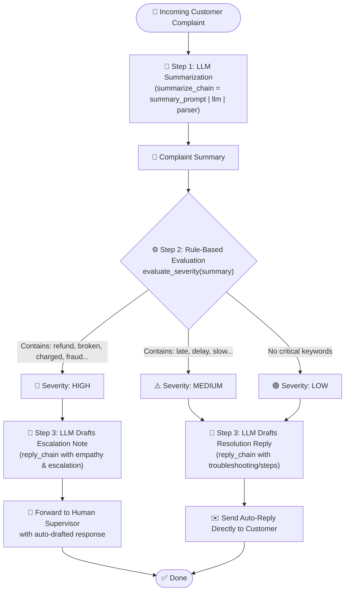

Viewed 05_custom_hybrid_chain.py:35-164

### Overview: What is [05_custom_hybrid_chain.py]?

This script demonstrates a **Hybrid AI Chain** for a customer support escalation system. 

Instead of relying 100% on an LLM to make all decisions, it combines:
1. 🤖 **Generative AI (LLM)**: For natural language understanding (summarization & polite reply generation).
2. ⚙️ **Deterministic Rule-Based Code (Python Heuristics)**: For strict, predictable severity checks (keyword matching).
3. 👤 **Human-in-the-Loop (HITL)**: Routing high-risk complaints for human supervisor escalation.

---

### 📊 Workflow Flowchart



---

### 🧩 Step-by-Step Code Breakdown

#### 1. Setup & Model Initialization ([Lines 31–58])
- Loads API keys from `.env` and provider configuration from `config.json`.
- Dynamically initializes either OpenAI (`ChatOpenAI`) or Google Gemini (`ChatGoogleGenerativeAI`).
- Creates a `StrOutputParser` to convert model message objects into plain text strings.

---

#### 2. LLM Summarization Chain ([Lines 71–78])
```python
summary_prompt = PromptTemplate(
    input_variables=["complaint"],
    template="Summarize this customer complaint briefly:\n\n{complaint}",
)
summarize_chain = summary_prompt | llm | parser
```
- **Purpose**: Condenses noisy/long customer text into key facts.
- **Why**: Standardized, concise text makes downstream keyword checks much cleaner and more reliable.

---

#### 3. Rule-Based Severity Evaluator ([Lines 81–96])
```python
def evaluate_severity(summary: str) -> str:
    summary_lower = summary.lower()
    severe_keywords = ["refund", "broken", "charged", "fraud", "not received", "angry"]
    moderate_keywords = ["late", "delay", "slow", "damaged packaging"]

    if any(word in summary_lower for word in severe_keywords):
        return "high"
    elif any(word in summary_lower for word in moderate_keywords):
        return "medium"
    return "low"
```
- **Purpose**: Pure Python deterministic heuristic (no LLM hallucination risk).
- **Categorization**:
  - `HIGH`: Financial or severe product issues (`charged`, `fraud`, `broken`, `refund`).
  - `MEDIUM`: Operational delays (`late`, `delay`, `slow`).
  - `LOW`: Routine queries / minor issues.

---

#### 4. Auto-Reply Generation Chain ([Lines 99–112])
```python
reply_prompt = PromptTemplate(
    input_variables=["summary", "severity"],
    template=(
        "You are a polite customer support assistant.\n"
        "Given the complaint summary below, write a short professional reply.\n"
        "If severity is 'high', express empathy and mention escalation.\n"
        "If severity is 'medium' or 'low', acknowledge and suggest resolution steps.\n\n"
        "Complaint Summary: {summary}\nSeverity Level: {severity}\n\nReply:"
    ),
)
reply_chain = reply_prompt | llm | parser
```
- Takes both the **`summary`** and the computed **`severity`** level as prompt variables.
- Dynamically adapts tone: apologetic + escalation message for high severity, or direct resolution steps for low/medium severity.

---

#### 5. Full Orchestration Logic ([Lines 117–140])
```python
def process_complaint(complaint: str) -> None:
    # 1. Summarize with LLM
    summary = summarize_chain.invoke({"complaint": complaint})
    
    # 2. Score with Rule-based logic
    severity = evaluate_severity(summary)
    
    # 3. Branching & Human-in-the-Loop decision
    if severity == "high":
        # Escalates to human supervisor with a pre-drafted response
        response = reply_chain.invoke({"summary": summary, "severity": severity})
        print("🚨 Escalation Required: Forwarding to human supervisor.")
    else:
        # Sends directly to customer
        response = reply_chain.invoke({"summary": summary, "severity": severity})
        print("🤖 Auto-Reply to Customer:")
```

---

### 💡 Why Use a Hybrid Architecture in Production?

| Pure LLM Approach | Hybrid Chain Approach (Used Here) |
| :--- | :--- |
| **Non-Deterministic**: An LLM might randomly decide not to escalate a critical issue. | **Guaranteed Escalation**: Critical business rules (e.g. refunds, fraud) are guaranteed by code. |
| **Higher Cost & Latency**: Running complex classification prompts on every step adds token costs. | **Lower Cost**: Uses LLM only where generative capabilities are actually needed. |
| **Autonomous Risk**: Fully autonomous replies on high-severity tickets can cause brand/legal damage. | **Human-in-the-Loop**: High-risk items pause for human review with pre-drafted replies ready to approve. |