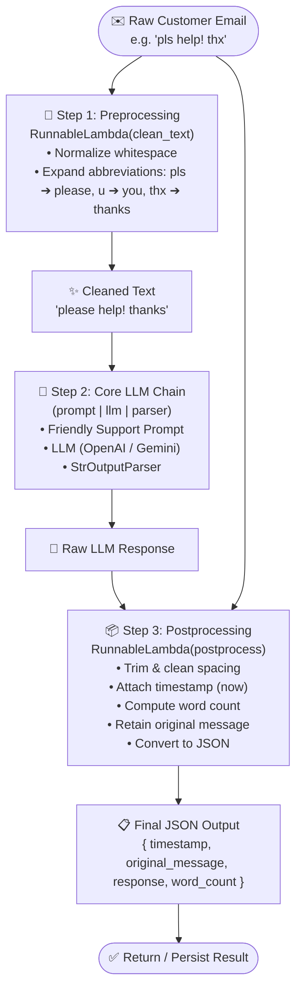

### Overview: What is [06_pre_post_processing_chain.py](file:///d:/projects/python/stepIntoAI/LangChain_02_Chains/06_pre_post_processing_chain.py)?

This script demonstrates a **Full Production-Grade Pipeline** that sandwiches the LLM between deterministic **Preprocessing** and **Postprocessing** layers.

In real-world enterprise applications, raw user inputs are often noisy, messy, or malformed, and raw LLM outputs often lack operational metadata (timestamps, audit tracking, metrics). This architecture ensures:
1. 🧹 **Input Sanitization (Preprocessing)**: Cleans shorthand, fixes slang/typos, and normalizes whitespaces before hitting the LLM.
2. 🤖 **Core LLM Generation**: Focuses solely on contextual, polite customer reply generation.
3. 📦 **Enrichment & Auditing (Postprocessing)**: Formats the response and bundles it with metadata (timestamp, original input, word count) in standard JSON.

---

### 📊 Workflow Flowchart



---

### 🧩 Step-by-Step Code Breakdown

#### 1. Setup & Dynamic Model Initialization ([Lines 35–60](file:///d:/projects/python/stepIntoAI/LangChain_02_Chains/06_pre_post_processing_chain.py#L35-L60))
- Loads API keys from `.env` and provider configuration from `config.json`.
- Dynamically initializes either OpenAI (`ChatOpenAI`) or Google Gemini (`ChatGoogleGenerativeAI`).
- Initializes `StrOutputParser` to parse the LLM's response message into a plain string.

---

#### 2. Preprocessing Function & `RunnableLambda` ([Lines 63–80](file:///d:/projects/python/stepIntoAI/LangChain_02_Chains/06_pre_post_processing_chain.py#L63-L80))
```python
def clean_text(raw_text: str) -> str:
    """Preprocesses the customer message: strips spaces, fixes common slang/typos."""
    text = raw_text.strip()
    text = re.sub(r"\s+", " ", text)
    text = text.replace("pls", "please").replace("u", "you").replace("thx", "thanks")
    return text

preprocess = RunnableLambda(clean_text)
```
- **`clean_text`**: Strips outer whitespace, collapses multiple spaces into a single space via regex `\s+`, and normalizes chat shorthand (`pls` ➔ `please`, `u` ➔ `you`, `thx` ➔ `thanks`).
- **`RunnableLambda`**: A LangChain wrapper that converts any standard Python function into a `Runnable` component that can be invoked (`.invoke()`) or chained using the LCEL pipe operator (`|`).

---

#### 3. Core LLM Generation Chain ([Lines 82–95](file:///d:/projects/python/stepIntoAI/LangChain_02_Chains/06_pre_post_processing_chain.py#L82-L95))
```python
prompt = PromptTemplate(
    input_variables=["cleaned_text"],
    template=(
        "You are a friendly customer support assistant.\n"
        "Given the cleaned message below, write a polite, clear, and helpful reply.\n\n"
        "Customer Message:\n{cleaned_text}"
    ),
)

core_chain = prompt | llm | parser
```
- **`PromptTemplate`**: Injects the cleaned text into a customer support prompt.
- **`core_chain`**: Composed using the LCEL pipe `|` (`prompt | llm | parser`).

---

#### 4. Postprocessing Function & Metadata Enrichment ([Lines 97–115](file:///d:/projects/python/stepIntoAI/LangChain_02_Chains/06_pre_post_processing_chain.py#L97-L115))
```python
def postprocess(response: str, original_text: str) -> str:
    """Postprocess the LLM output and add metadata."""
    clean_response = response.strip().replace("\n\n", "\n")
    meta = {
        "timestamp": datetime.now().strftime("%Y-%m-%d %H:%M:%S"),
        "original_message": original_text,
        "response": clean_response,
        "word_count": len(clean_response.split()),
    }
    return json.dumps(meta, indent=2)

postprocess_chain = RunnableLambda(
    lambda output: postprocess(output["response"], output["input"])
)
```
- **Formatting**: Strips edge whitespace and collapses excessive blank lines (`\n\n` ➔ `\n`).
- **Metadata Enrichment**:
  - `timestamp`: Captures the execution time for logging/auditing.
  - `original_message`: Preserves the raw customer input for traceability.
  - `response`: The clean AI assistant response.
  - `word_count`: Metric for monitoring response length.
- **JSON Serialization**: Returns a structured JSON string formatted with 2-space indentation.

---

#### 5. Complete End-to-End Execution Pipeline ([Lines 117–134](file:///d:/projects/python/stepIntoAI/LangChain_02_Chains/06_pre_post_processing_chain.py#L117-L134))
```python
def process_email(email_text: str) -> str:
    # Step 1: Preprocess (sanitize input)
    cleaned = preprocess.invoke(email_text)

    # Step 2: Core LLM call (generate response)
    response = core_chain.invoke({"cleaned_text": cleaned})

    # Step 3: Postprocess (enrich with metadata & format JSON)
    final_result = postprocess_chain.invoke({"response": response, "input": email_text})

    return final_result
```

---

### 💡 Why Pre- and Post-Processing are Critical in Production

| Aspect | Without Pre/Post-Processing | With Pre/Post-Processing Pipeline |
| :--- | :--- | :--- |
| **Token Efficiency** | Noisy spaces and messy text waste tokens on every call. | Cleaned and normalized text reduces unnecessary token usage. |
| **Prompt Reliability** | Typos and slang can confuse prompt instructions or alter tone. | Standardized vocabulary yields consistent, higher-quality LLM outputs. |
| **Observability & Auditing** | Only raw response text is received; hard to log and trace. | Structured JSON with timestamp, input, and word count enables logging and analytics. |
| **Downstream Integration** | Downstream services must parse unstructured text. | API-ready JSON makes it easy to integrate with CRM, ticketing, and webhooks. |
