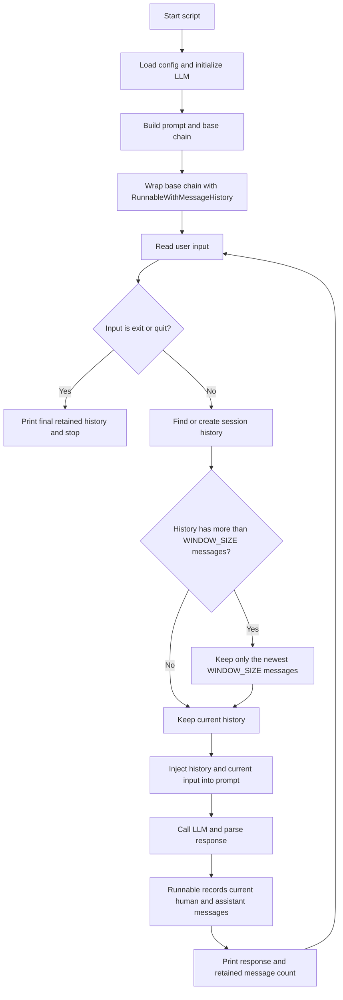

# Buffer Window Memory

Reference for [`03_buffer_window_memory.py`](../03_buffer_window_memory.py).

## Concept

Buffer window memory keeps only the newest fixed number of chat messages. It preserves recent conversational context while discarding older messages, so the prompt does not grow forever.

In this example, `WINDOW_SIZE = 4` means **four messages**, not four complete exchanges. A normal exchange contains one human message and one assistant message, so four messages usually represent two exchanges.

The history is held in an `InMemoryChatMessageHistory` object inside the process-local `store` dictionary. It is not persistent storage: restarting the script loses the conversations.

## Runtime Flow



## Step-by-Step

1. The script creates a prompt containing `{history}` and `{input}`.
2. `RunnableWithMessageHistory` uses the configured `session_id` to select a history object.
3. `get_session_history()` creates the session on first use and trims old messages before the chain runs.
4. The retained history and the new input are passed to the prompt.
5. The model generates a response and `StrOutputParser` converts it to a string.
6. `RunnableWithMessageHistory` records the new human and assistant messages.
7. On the next turn, the oldest messages are removed if the history is above the window.

## Example

With `WINDOW_SIZE = 4`, the history evolves like this:

| Turn | Messages retained |
| --- | --- |
| 1 | User 1, Assistant 1 |
| 2 | User 1, Assistant 1, User 2, Assistant 2 |
| 3 | User 2, Assistant 2, User 3, Assistant 3 |

The third turn drops the first exchange because the history has exceeded four messages.

## Strengths and Limitations

**Strengths**

- Predictable memory usage based on message count.
- Very cheap to implement and maintain.
- Useful when recent context matters more than older context.

**Limitations**

- Messages vary in length, so four short messages and four long messages can use very different numbers of tokens.
- Older facts disappear without a summary or other durable memory.
- `InMemoryChatMessageHistory` is process-local and non-persistent.

## Key Implementation Details

```python
WINDOW_SIZE = 4

if len(history.messages) > WINDOW_SIZE:
    history.messages = history.messages[-WINDOW_SIZE:]
```

To retain complete exchanges, choose an even window size. The current implementation slices messages directly, so an odd value could leave an unmatched human or assistant message at the boundary.

## When to Use It

Use a buffer window when:

- the conversation should feel responsive and recent;
- a simple, predictable context policy is sufficient;
- approximate token usage is acceptable;
- older conversation can safely be forgotten.
