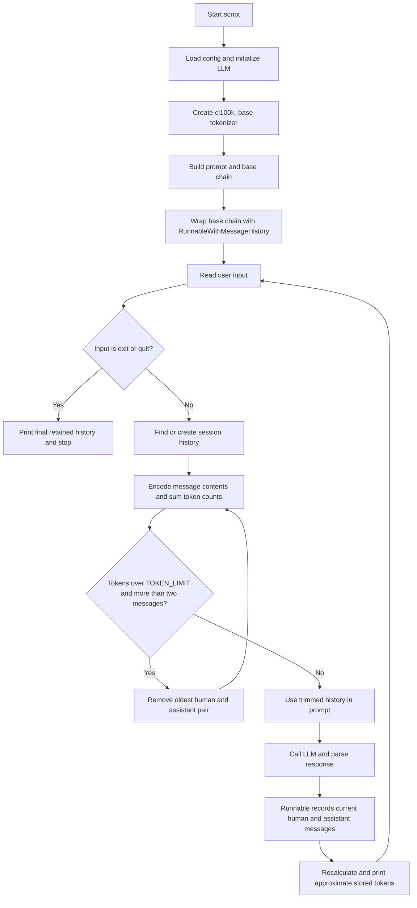

# Token Buffer Memory

Reference for [`04_token_buffer_memory.py`](../04_token_buffer_memory.py).

## Concept

Token buffer memory keeps conversation history under an approximate token budget rather than under a fixed message count. Because model context limits are measured in tokens, this policy adapts better to messages of different lengths.

This example uses `TOKEN_LIMIT = 250` and the `cl100k_base` tokenizer from `tiktoken`. The count is intentionally described as approximate: it counts encoded message text only, not every token added by the final provider-specific prompt or message formatting.

The history is stored in an in-process `store` dictionary containing `InMemoryChatMessageHistory` instances. No history survives a process restart.

## Runtime Flow



## Step-by-Step

1. The script creates a tokenizer and sets the approximate `TOKEN_LIMIT`.
2. `RunnableWithMessageHistory` uses `session_id` to select a history object.
3. `get_session_history()` calculates the total encoded length of each message's `.content`.
4. While the total exceeds the limit and more than two messages remain, it removes `history.messages[0:2]`.
5. Removing two messages at a time keeps a normal human/assistant pair together.
6. The remaining history and current input are injected into the prompt.
7. The model produces a response, which is parsed into a string.
8. The runnable records the new human and assistant messages.
9. The script recounts the stored history and displays the approximate token total.

## Example

Assume the configured limit is `250` tokens:

| Stage | History | Approximate result |
| --- | --- | --- |
| Before trimming | Pair 1 + Pair 2 + Pair 3 | Over 250 tokens |
| Remove oldest pair | Pair 2 + Pair 3 | Recount |
| Continue if needed | Pair 3 | Stop once within the limit or only two messages remain |

The algorithm removes complete pairs from the oldest end. If the newest pair alone is very large, the `len(history.messages) > 2` guard prevents it from being removed; the stored history can therefore still exceed `TOKEN_LIMIT`.

## Strengths and Limitations

**Strengths**

- Aligns retention more closely with model context capacity.
- Handles short and long messages more fairly than a fixed message window.
- Keeps recent human/assistant pairs together.

**Limitations**

- `cl100k_base` is a GPT-oriented approximation and may not match Gemini or another provider's tokenizer.
- The implementation counts message contents only; prompt instructions, wrappers, and the current input also consume context.
- Trimming removes information permanently from the active history; it does not summarize it.
- A single very large pair can remain above the budget because trimming stops when only two messages are left.
- `InMemoryChatMessageHistory` is process-local and non-persistent.

## Key Implementation Details

```python
def num_tokens_from_messages(messages: List[str]) -> int:
    return sum(len(encoding.encode(m)) for m in messages)

while total_tokens > TOKEN_LIMIT and len(history.messages) > 2:
    history.messages = history.messages[2:]
    total_tokens = num_tokens_from_messages(
        [m.content for m in history.messages]
    )
```

The trim check runs whenever `get_session_history()` is called. In this script it runs before the next model invocation and again when the loop displays memory statistics.

## When to Use It

Use token buffer memory when:

- the model's context limit is the primary constraint;
- message lengths vary significantly;
- retaining the newest complete exchanges is more useful than retaining a fixed number of messages;
- approximate provider-specific token counting is acceptable.

For production systems, consider using the target model's tokenizer, reserving space for the prompt and current input, and replacing discarded history with a summary when older facts still matter.
