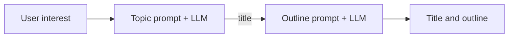

# 01 - Legacy SequentialChain Pipeline

Source: `01_chain_based_pipeline.py`

## Core idea

This program shows the older LangChain way to build a multi-step LLM workflow with `LLMChain` objects wrapped in a `SequentialChain`.

The pipeline turns one user input into two related artifacts:

```text
interest
   |
   v
[LLMChain: create title]
   |  title
   v
[LLMChain: create outline]
   |
   v
{ title, outline }
```



## Crux of the program

- `topic_chain` accepts `interest` and emits a value under the key `title`.
- `outline_chain` accepts `title` and emits a value under the key `outline`.
- `SequentialChain` manages the shared dictionary and passes the first result into the second step.
- `output_key` and `input_variables` make the data contract explicit.

> **Highlight:** The important concept is not blog writing. It is **named intermediate state moving through an ordered workflow**.

## Problem solved

A multi-step prompt process should be repeatable instead of manually calling an LLM, copying its response, and inserting that response into another prompt.

## Real-world purpose

This pattern can support a basic content workflow such as topic research -> draft outline -> article draft, or support ticket text -> category -> suggested response. The explicit keys are useful when each stage has a known input and output contract.

## Tradeoff

`SequentialChain` makes the flow understandable, but it requires more configuration and legacy-specific objects. The next example expresses the same idea with the modern Runnable interface.
