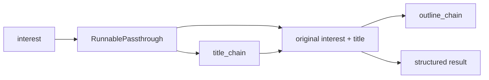

# 02 - Modern Runnable Composition

Source: `02_runnable_sequence.py`

## Core idea

This program rebuilds the previous title -> outline workflow using LangChain Runnables. Each stage is a composable unit, and the pipe operator (`|`) describes a sequence:

```text
input -> prompt -> model -> string parser
```

The outer flow preserves the original input, adds `title`, then adds `outline`:



## Crux of the program

- Each chain is built as `prompt | llm | StrOutputParser()`.
- `RunnablePassthrough()` carries the input dictionary forward.
- `.assign(title=title_chain)` adds a new field without discarding existing fields.
- `.assign(outline=outline_chain)` uses the accumulated dictionary, including `title`.

> **Highlight:** The central shift is from configuring a special chain container to **composing ordinary runnable steps with a small, readable data flow**.

## Problem solved

The program reduces boilerplate around sequential LLM calls while keeping intermediate results available for later steps. It also gives each component a common interface such as `invoke`, which makes pipelines easier to rearrange and reuse.

## Real-world purpose

This style fits production workflows that grow over time: extract fields from a document, enrich them, validate them, and format a final response. The same runnable can also be invoked in batches, streamed, or embedded inside a larger graph.

## Relationship to program 01

Both programs solve the same content-generation problem. Program 01 emphasizes explicit legacy input/output declarations; this program emphasizes composition and data preservation. The behavior is conceptually similar, but the Runnable API is more general.
