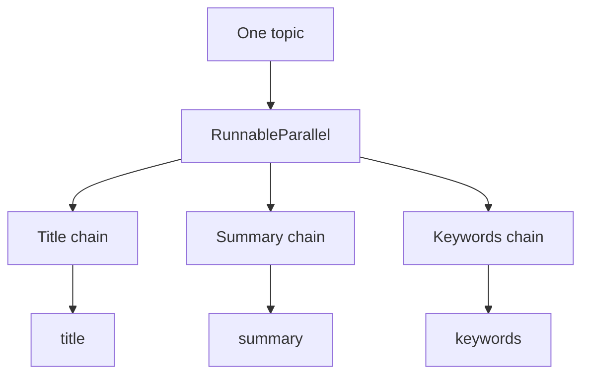

# 03 - Parallel Fan-Out With RunnableParallel

Source: `03_runnable_parallel.py`

## Core idea

Given one topic, the program launches three independent transformations: a title, a summary, and keywords.



The result is a dictionary:

```text
{
  title: ...,
  summary: ...,
  keywords: ...
}
```

## Crux of the program

- Each branch receives the same input key, `topic`.
- Each branch can have its own prompt, model, parser, or non-LLM logic.
- `RunnableParallel` combines the branch results under the names supplied during construction.
- The branches do not depend on one another, so they are natural candidates for concurrent execution.

> **Highlight:** Use parallel fan-out when one input must produce **several independent views** of the same data.

## Problem solved

Running independent LLM tasks one after another wastes latency. This pattern lets the framework coordinate separate branches and return one structured result.

## Real-world purpose

For a publishing tool, one topic can produce metadata, a description, search keywords, and social copy at once. Similar fan-out workflows can extract invoice fields, classify a document, and generate a risk note from the same source.

## Design boundary

Parallelism helps only when branches are independent. If branch B needs branch A's output, use a sequence or an assigned intermediate field instead.
