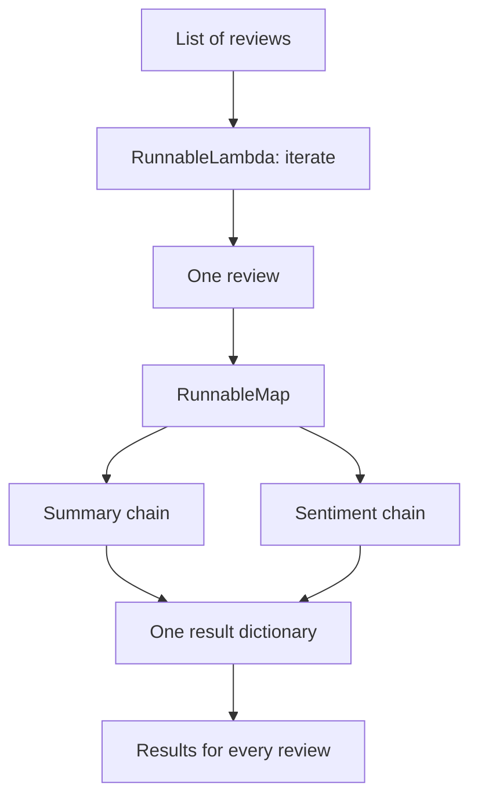

# 04 - Per-Item Analysis With RunnableMap

Source: `04_runnable_map.py`

## Core idea

This example applies two analyses to every customer review: a one-sentence summary and a sentiment label.

There are two distinct layers in the code:

## Crux of the program

- `single_review_processor` is a `RunnableMap` with two named branches: `summary` and `sentiment`.
- Both branches read the same `review`, so they can run independently for that item.
- `batch_processor` is a `RunnableLambda` that iterates over `inputs["reviews"]` and invokes the single-review processor for each one.
- The final value is a list of dictionaries, one dictionary per review.

> **Highlight:** In this specific program, `RunnableMap` is the **per-review fan-out**. The outer list processing is an explicit Python loop inside `RunnableLambda`, not one automatic `RunnableMap` over the entire list.

## Problem solved

Manually repeating the same analysis code for every review is error-prone and difficult to extend. The program defines the analysis once and applies it consistently to many records.

## Real-world purpose

This is a small batch-analysis pattern for customer feedback, support tickets, survey responses, documents, or moderation queues. New fields such as urgency, product area, or language can be added as more branches in the per-item map.

## Scaling note

The teaching example invokes items one by one. For large workloads, a production version would usually add batching, concurrency limits, retries, rate-limit handling, and structured output validation.
