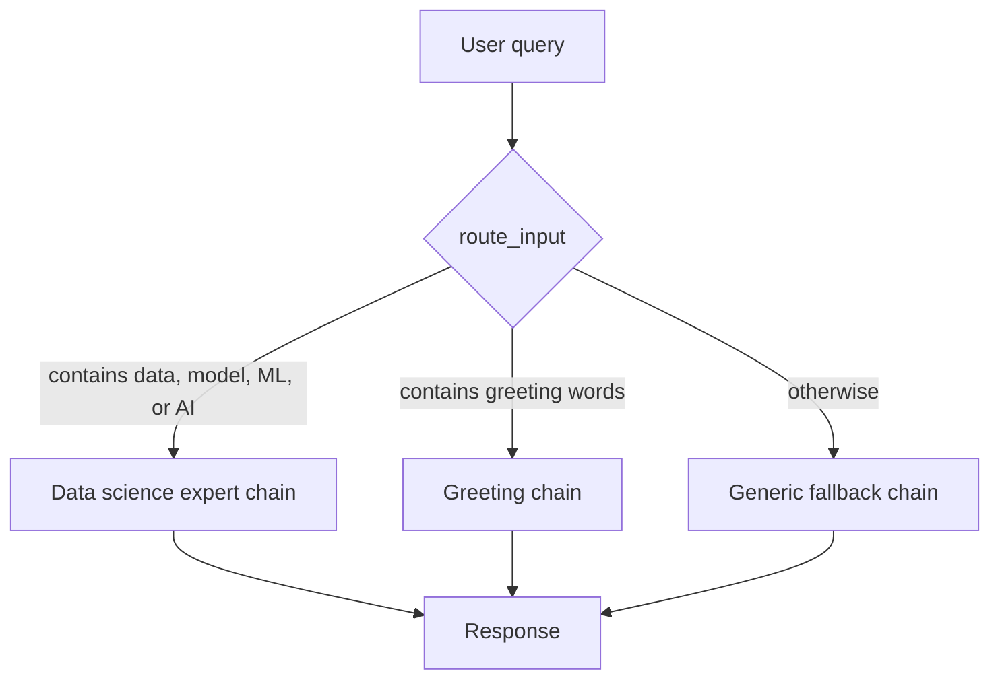

# 05 - Conditional Routing With RunnableBranch

Source: `05_runnable_branch.py`

## Core idea

This program chooses a response chain based on the kind of user message. It has two tested routes and a default route:

## Crux of the program

- `route_input` converts the query to lowercase and returns a route name.
- `RunnableBranch` evaluates conditions in order.
- The first matching condition selects its chain.
- `generic_chain` is the default, so unmatched input still receives a response.
- Every branch accepts the same shape, `{"query": ...}`, and produces a string response.

> **Highlight:** The important idea is **policy-driven dispatch**: classify the request first, then send it to a specialized behavior.

## Problem solved

One prompt is rarely ideal for every kind of request. Conditional routing keeps specialized instructions separate and prevents unrelated requests from being handled by the wrong persona or workflow.

## Real-world purpose

A support assistant might route billing questions to a billing workflow, technical incidents to troubleshooting, and casual conversation to a general assistant. In an enterprise system, routes can also select tools, permissions, retrieval sources, or escalation paths.

## Limitation and improvement path

The demo uses keyword matching, so a word can trigger a route even when the meaning is different, and related wording can be missed. A production router could use a classifier, structured LLM output, or a rules-plus-confidence design, with tests for ambiguous and adversarial inputs.
