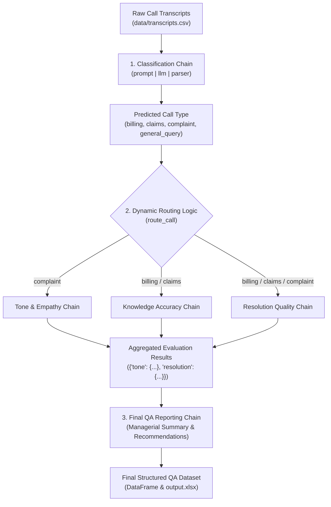

Listed directory customer_support_AI_pipeline
Viewed exp1.ipynb:1-800
Viewed exp1.ipynb:800-854
Viewed readme.md:1-260
Viewed config.json:1-26
Listed directory data

# Customer Support AI QA Pipeline — Notebook Analysis & Learning Reference

This document provides a comprehensive analysis and annotated learning guide for the customer support QA evaluator notebook ([`exp1.ipynb`](file:///f:/deepak/projects/langchain_essentials/customer_support_AI_pipeline/exp1.ipynb)).

---

## 1. High-Level Pipeline Architecture

The notebook implements a **multi-stage LLM evaluation pipeline (LLM-as-a-Judge)** with dynamic routing and structured schema enforcement.



---

## 2. Core LangChain Classes & Concepts Deep-Dive

### A. Model Abstraction Layer: `ChatOpenAI` & `ChatGoogleGenerativeAI`
* **Modules**: `langchain_openai`, `langchain_google_genai`
* **Base Class**: `BaseChatModel` (from `langchain_core.language_models.chat_models`)
* **Concept**:
  * Provides a unified, provider-agnostic interface across different model vendors (OpenAI GPT, Google Gemini, Anthropic Claude, etc.).
  * Standardizes inputs (strings or `BaseMessage` objects like `SystemMessage`, `HumanMessage`, `AIMessage`) and outputs (`AIMessage` containing `.content`, `.response_metadata`, token usage, etc.).
  * Configurable with parameters such as `model`, `temperature` (randomness/creativity control: `0.0` for deterministic evaluation, `0.7+` for creative generation).

---

### B. Prompt Engineering: `PromptTemplate` & Partial Variables
* **Module**: `langchain_core.prompts.PromptTemplate`
* **Base Class**: `BasePromptTemplate` (implements the `Runnable` protocol)
* **Key Mechanisms in the Notebook**:
  1. **`template`**: The raw string with bracketed formatting placeholders (e.g. `{transcript}`, `{format_instructions}`).
  2. **`input_variables`**: Dynamic parameters required at execution time (e.g. `["transcript"]`).
  3. **`partial_variables`**: Static or pre-computed values injected once when the template is created (e.g. `format_instructions` from parser, `labels` from config), eliminating redundant parameter passing during runtime.

```python
prompt = PromptTemplate(
    template="Classify into {labels}:\n{transcript}\n{format_instructions}",
    input_variables=["transcript"],      # Provided dynamically at .invoke()
    partial_variables={                  # Bound statically at initialization
        "format_instructions": parser.get_format_instructions(),
        "labels": config["classification"]["labels"]
    }
)
```

---

### C. Schema Enforcement & Parsing: `PydanticOutputParser` & `pydantic.BaseModel`
* **Modules**: `langchain_core.output_parsers.PydanticOutputParser`, `pydantic.BaseModel`, `pydantic.Field`
* **Base Class**: `BaseOutputParser` (implements `Runnable`)
* **How It Works**:
  1. **Schema Definition**: You define a Pydantic class specifying typed attributes with `Field(description="...")`.
  2. **Format Instruction Generation**: `parser.get_format_instructions()` extracts JSON schema constraints and appends instructions to the prompt (e.g., *"The output should be formatted as a JSON instance that matches the following schema..."*).
  3. **Output Parsing & Validation**: When raw text arrives from the LLM, the parser strips markdown backticks, validates the JSON against the Pydantic model, and returns a fully typed Python object.

```python
class ClassificationOutput(BaseModel):
    call_type: str = Field(description="Type of customer call")
    confidence: float = Field(description="Confidence score between 0 and 1")

parser = PydanticOutputParser(pydantic_object=ClassificationOutput)
```

---

### D. LCEL (LangChain Expression Language) & The Pipe Operator `|`
* **Module**: `langchain_core.runnables`
* **Concept**:
  * LCEL uses Python's bitwise OR operator `|` to compose independent components into a `RunnableSequence`.
  * Every component in LCEL implements standard synchronous and asynchronous execution methods:
    * `.invoke(input)`: Single item synchronous processing.
    * `.batch([inputs])`: Parallel/batch execution.
    * `.stream(input)`: Streaming chunks as they generate.
    * `.ainvoke()`, `.abatch()`, `.astream()`: Asynchronous counterparts.

```python
# prompt (dict -> PromptValue) | llm (PromptValue -> AIMessage) | parser (AIMessage -> Pydantic Model)
classification_chain = prompt | llm | parser

output = classification_chain.invoke({"transcript": sample_text})
# output is an instance of ClassificationOutput (e.g. output.call_type, output.confidence)
```

---

## 3. Cell-by-Cell Annotated Walkthrough

### Cell 1 & 2: Environment, Configuration, and Multi-Provider LLM Loader

```python
# --- Step 1 & 2: Load Environment & Dependencies ---
import os
import json
import pandas as pd
from dotenv import load_dotenv

# load_dotenv reads key-value pairs from .env and sets them as environment variables
load_dotenv()

# --- Step 3: Load Configuration ---
# Centralized configuration separates runtime settings from application code
with open("config/config.json", "r") as f:
    config = json.load(f)

# --- Step 4: Load Dataset ---
df = pd.read_csv("data/transcripts.csv")

# --- Step 5: Multi-Provider LLM Factory Pattern ---
from langchain_openai import ChatOpenAI
from langchain_google_genai import ChatGoogleGenerativeAI

def load_llm(config):
    """
    Factory function creating an LLM client instance based on LLM_PROVIDER.
    Enables switching between OpenAI and Google Gemini without altering downstream chains.
    """
    provider = os.getenv("LLM_PROVIDER")

    if provider == "openai":
        return ChatOpenAI(
            model=config["llm"]["openai_model"],
            temperature=config["llm"]["temperature"]
        )
    elif provider == "gemini":
        return ChatGoogleGenerativeAI(
            model=config["llm"]["gemini_model"],
            temperature=config["llm"]["temperature"]
        )
    else:
        raise ValueError("Invalid LLM_PROVIDER")

llm = load_llm(config)

# --- Step 6: Health Check / Smoke Test ---
# Invoking the LLM directly with a string input (implicit HumanMessage)
response = llm.invoke("Say 'setup successful' in one short sentence.")
print(response.content)
```

**Key Takeaways**:
- **Factory Pattern**: Decouples model provider selection from evaluation chains.
- **`temperature=0.3`**: Kept low for deterministic, objective classification and evaluation.

---

### Cell 3: Intent Classification Chain with Pydantic Parsing

```python
from langchain_core.prompts import PromptTemplate
from langchain_core.output_parsers import PydanticOutputParser
from pydantic import BaseModel, Field

# 1. Define Expected JSON Schema as a Pydantic Model
class ClassificationOutput(BaseModel):
    call_type: str = Field(description="Type of customer call")
    confidence: float = Field(description="Confidence score between 0 and 1")

# 2. Instantiate Parser targeting the schema
parser = PydanticOutputParser(pydantic_object=ClassificationOutput)

# 3. Construct Prompt with Static & Dynamic Variables
prompt = PromptTemplate(
    template="""
You are a call classification assistant.

Classify the following customer support transcript into one of these categories:
{labels}

Transcript:
{transcript}

{format_instructions}
""",
    input_variables=["transcript"],
    partial_variables={
        # Inject parser instructions: guides LLM to return valid JSON with schema constraints
        "format_instructions": parser.get_format_instructions(),
        # Inject labels directly from config file: eliminates hardcoding labels in prompt
        "labels": config["classification"]["labels"]
    }
)

# 4. Chain Composition via LCEL
classification_chain = prompt | llm | parser

# 5. Execution Test
sample_text = df.iloc[0]["transcript"]
result = classification_chain.invoke({"transcript": sample_text})
# result -> ClassificationOutput(call_type='billing', confidence=0.98)
```

**Key Takeaways**:
- `partial_variables` keeps the calling interface clean: you only pass `{"transcript": text}` when invoking.
- The output parser automatically handles JSON decoding and type conversion (`confidence` becomes a Python `float`).

---

### Cell 4: Batch Dataset Classification with Resilient Error Handling

```python
from tqdm import tqdm

results = []

for i, row in tqdm(df.iterrows(), total=len(df), desc="Classifying Calls"):
    try:
        output = classification_chain.invoke({
            "transcript": row["transcript"]
        })
        results.append({
            "call_id": row["call_id"],
            "predicted_call_type": output.call_type,
            "confidence": output.confidence
        })
    except Exception as e:
        # Fallback prevents a single parsing/network failure from aborting entire batch
        print(f"❌ Error at row {i}: {e}")
        results.append({
            "call_id": row["call_id"],
            "predicted_call_type": None,
            "confidence": None
        })

results_df = pd.DataFrame(results)
df = df.merge(results_df, on="call_id")
```

**Key Takeaways**:
- Batch operations against LLMs must always incorporate `try/except` safeguards against rate-limiting, malformed JSON, or context overflow.

---

### Cell 5: Dynamic Routing Layer

```python
def route_call(call_type):
    """
    Dynamic Router: Determines which evaluation dimensions are relevant based on call classification.
    Optimizes token usage and avoids running unnecessary evaluations.
    """
    if call_type == "billing":
        return ["knowledge_accuracy", "resolution_quality"]
    elif call_type == "claims":
        return ["knowledge_accuracy", "resolution_quality"]
    elif call_type == "complaint":
        return ["tone_empathy", "resolution_quality"]
    elif call_type == "general_query":
        return ["knowledge_accuracy"]
    else:
        return ["knowledge_accuracy"]  # Fallback

df["evaluation_plan"] = df["predicted_call_type"].apply(route_call)
```

**Key Takeaways**:
- **Conditional Evaluation Pattern**: Complaints require empathy checks (`tone_empathy`), whereas general queries require accuracy checks (`knowledge_accuracy`). This reduces evaluation latency and API cost.

---

### Cells 6, 7 & 8: Modular Specialized Evaluators

Each dimension has its own schema, evaluation rubric, and chain:

```python
# --- Evaluator 1: Tone & Empathy ---
class ToneEvaluation(BaseModel):
    score: int = Field(description="Score between 1 and 5")
    reasoning: str = Field(description="Explanation of the score")

tone_parser = PydanticOutputParser(pydantic_object=ToneEvaluation)
tone_prompt = PromptTemplate(
    template="""You are a QA evaluator for customer support calls.
Evaluate the agent's tone and empathy in the following transcript.
Consider:
- Did the agent acknowledge the customer's issue?
- Was the tone polite and professional?
- Did the agent show empathy?

Transcript:
{transcript}

{format_instructions}""",
    input_variables=["transcript"],
    partial_variables={"format_instructions": tone_parser.get_format_instructions()}
)
tone_chain = tone_prompt | llm | tone_parser


# --- Evaluator 2: Resolution Quality ---
class ResolutionEvaluation(BaseModel):
    score: int = Field(description="Score between 1 and 5")
    reasoning: str = Field(description="Explanation of the score")

resolution_parser = PydanticOutputParser(pydantic_object=ResolutionEvaluation)
resolution_prompt = PromptTemplate(
    template="""You are a QA evaluator for customer support calls.
Evaluate the resolution quality of the agent.
Consider:
- Did the agent fully resolve the customer's issue?
- Were next steps clearly communicated?
- Did the agent confirm resolution before ending?

Transcript:
{transcript}

{format_instructions}""",
    input_variables=["transcript"],
    partial_variables={"format_instructions": resolution_parser.get_format_instructions()}
)
resolution_chain = resolution_prompt | llm | resolution_parser


# --- Evaluator 3: Knowledge Accuracy ---
class KnowledgeEvaluation(BaseModel):
    score: int = Field(description="Score between 1 and 5")
    reasoning: str = Field(description="Explanation of the score")

knowledge_parser = PydanticOutputParser(pydantic_object=KnowledgeEvaluation)
knowledge_prompt = PromptTemplate(
    template="""You are a QA evaluator for customer support calls.
Evaluate the agent's knowledge accuracy and clarity.
Consider:
- Did the agent provide correct and relevant information?
- Was the explanation clear and easy to understand?
- Did the agent avoid vague or misleading statements?
IMPORTANT:
- If the transcript does not contain enough information, give a moderate score (2 or 3) and explain why.

Transcript:
{transcript}

{format_instructions}""",
    input_variables=["transcript"],
    partial_variables={"format_instructions": knowledge_parser.get_format_instructions()}
)
knowledge_chain = knowledge_prompt | llm | knowledge_parser
```

**Key Takeaways**:
- **Single Responsibility Principle (SRP)**: Rather than asking one monolithic prompt to evaluate 5 different qualities simultaneously (which degrades LLM attention and accuracy), separate specialized evaluator chains yield higher grading reliability.
- **Structured Reasoning (`reasoning` + `score`)**: Enforcing chain-of-thought style justification before or alongside the score improves grading consistency.

---

### Cell 9: Evaluation Orchestrator

```python
def run_evaluations(transcript, eval_plan):
    """
    Executes chains conditionally according to the call's dynamic evaluation plan.
    Converts Pydantic objects into dictionaries using .model_dump().
    """
    results = {}

    if "tone_empathy" in eval_plan:
        try:
            tone_result = tone_chain.invoke({"transcript": transcript})
            results["tone"] = tone_result.model_dump()
        except Exception as e:
            results["tone"] = {"error": str(e)}

    if "knowledge_accuracy" in eval_plan:
        try:
            knowledge_result = knowledge_chain.invoke({"transcript": transcript})
            results["knowledge"] = knowledge_result.model_dump()
        except Exception as e:
            results["knowledge"] = {"error": str(e)}

    if "resolution_quality" in eval_plan:
        try:
            resolution_result = resolution_chain.invoke({"transcript": transcript})
            results["resolution"] = resolution_result.model_dump()
        except Exception as e:
            results["resolution"] = {"error": str(e)}

    return results
```

---

### Cell 10 & 11: Hierarchical Aggregation & Managerial QA Report Synthesis

```python
# --- Schema: Synthesized Managerial QA Report ---
class FinalReport(BaseModel):
    summary: str = Field(description="Overall evaluation summary")
    recommendations: list[str] = Field(description="List of actionable improvements")

final_parser = PydanticOutputParser(pydantic_object=FinalReport)

final_prompt = PromptTemplate(
    template="""
You are a QA manager reviewing customer support calls.

Based on the evaluation results below, generate:
1. A concise summary of the agent's performance
2. A list of actionable recommendations for improvement

Evaluation Data:
{evaluation_output}

IMPORTANT:
- Be specific and practical
- Do not repeat scores
- Focus on improvement

{format_instructions}
""",
    input_variables=["evaluation_output"],
    partial_variables={
        "format_instructions": final_parser.get_format_instructions()
    }
)

final_chain = final_prompt | llm | final_parser
```

**Key Takeaways**:
- **Hierarchical LLM Synthesis**: Output from lower-level evaluator agents is fed as structured input into a higher-level supervisor chain to generate strategic feedback and coaching recommendations.

---

### Cell 12 & 13: Accuracy Calculation & Export

```python
# Classification accuracy evaluation against ground truth
accuracy = (df["expected_call_type"] == df["predicted_call_type"]).mean()
print(f"🎯 Classification Accuracy: {accuracy:.2f}")

# Persist rich evaluation DataFrame to Excel
df.to_excel("data/output.xlsx", index=False)
```

---

## 4. Key Design Patterns Demonstrated

| Pattern | Implementation in Notebook | Benefit |
| :--- | :--- | :--- |
| **LLM Factory** | `load_llm(config)` | Allows hot-swapping providers (OpenAI / Gemini) with zero chain refactoring. |
| **Schema Validation** | `PydanticOutputParser` + `BaseModel` | Guarantees strictly typed, downstream-consumable JSON outputs. |
| **Partial Prompt Injection** | `partial_variables` in `PromptTemplate` | Pre-bakes instructions/labels; callers only supply runtime variables. |
| **Dynamic Routing** | `route_call()` + conditional execution | Minimizes API cost and inference latency by executing only relevant evaluators. |
| **Multi-Stage Synthesis** | Evaluator chains $\rightarrow$ `FinalReport` chain | Separates low-level metric scoring from high-level coaching/reporting. |

---

## 5. Modern LangChain Production Best Practices & Alternatives

When transitioning this prototype into production services (e.g. `src/` modules), consider these advanced patterns:

### 1. Native Tool Calling / Structured Output (`.with_structured_output`)
Modern chat models support native function calling / structured output, which is faster and less prone to parsing errors than prompt-based `PydanticOutputParser`:

```python
# Modern LangChain alternative to PydanticOutputParser:
structured_llm = llm.with_structured_output(ClassificationOutput)
classification_chain = prompt | structured_llm
# Direct invocation returns a validated ClassificationOutput instance
```

### 2. `ChatPromptTemplate` with Role-Based Messages
Using explicit system and human roles provides better instruction adherence across models:

```python
from langchain_core.prompts import ChatPromptTemplate

chat_prompt = ChatPromptTemplate.from_messages([
    ("system", "You are an expert QA evaluator for customer support calls."),
    ("human", "Evaluate transcript:\n{transcript}\n\n{format_instructions}")
])
```

### 3. Parallel Batch Execution (`RunnableParallel` / `.abatch()`)
Instead of sequential row-by-row iteration in Python loops, use asynchronous batch execution:

```python
# Batch execution with automatic concurrency management
inputs = [{"transcript": row["transcript"]} for _, row in df.iterrows()]
outputs = classification_chain.batch(inputs, config={"max_concurrency": 5})
```